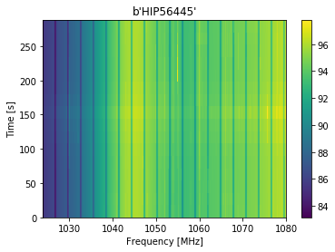
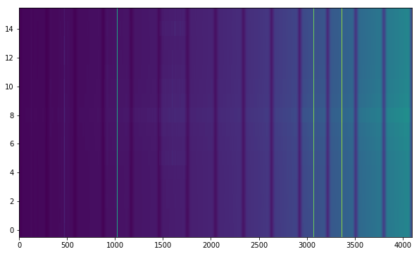
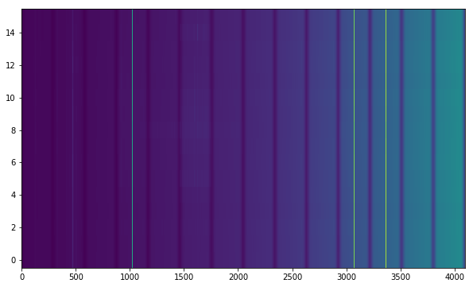
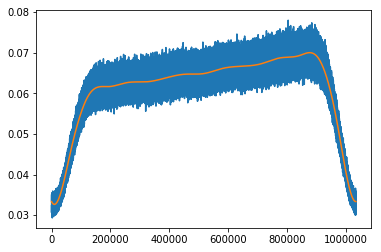
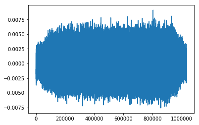
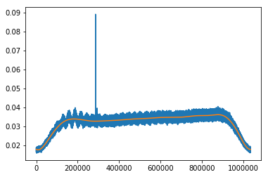
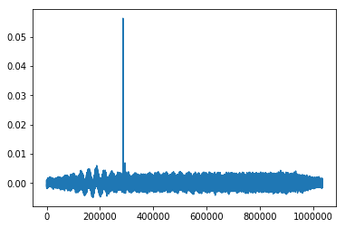
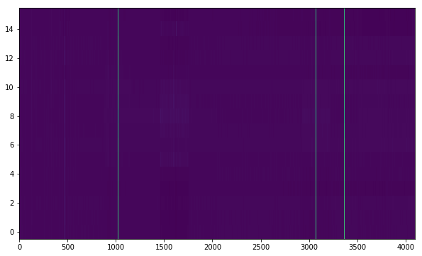

# Energy Detection and Signal Matching in SETI

## Background

(Skipping generic text about how important SETI is)

A lot of the data that Breakthrough Listen is collecting is in the form of dynamic spectrums, which we call waterfalls. They look like this:

The x axis is Frequency, the y axis is time, and each point has a power reading representing how much energy is coming from that frequency at that timestep.

If you look at the part where the frequency is about 1060 Mhz, you can see a thin bright line in the plot, that's a signal, and if you look closely, there are many more bright lines in the plot, which are of course all signals picked up by the telescope.

The goal of this project is building a database of "seen" signals and constructing a pipeline for picking out signals from every observation and using dimensionality reduction to match them to seen ones. If we find a signal that's unseen before from any of our observations, that means we've found ET! (or a bug)

## Preprocessing

### Broadband Signal Removal
In our observations, there will often be broadband signals (for example at t=150s in the plot above). These signals come from high energy FRI that spill over all the channels. For this project, we are only interested in narrowband signals because we are assuming an extraterrestial transmitter would choose to transmit in narrower bands.

To remove the broadband signals, we normalize the average power of each spectrum (timestep) to 1. Because these files are very large: about 16 GB each, we use Dask to process the file in parallel, speeding up the computation process and removing the need to read the whole file into memory.

The resulting plot is mostly the same as the original, but without the broadband features. In the example below, there was a broadband "burst" in the 8th spectrum. After processing, the "burst" was removed.

| Original | Broadband Features Removed |
| ----- | -----|
|  | 

The result is stored as 22 npy blocks, each containing 16 spectrums in 14 channels (the original file is 16 spectrums by 308 channels).

### Bandpass Removal
[describe bandpass]

To remove the bandpass, we use [spline lines](https://en.wikipedia.org/wiki/Spline_(mathematics)) to fit each channel to obtain a model of the bandpass of that channel. By using splines, we are able to fit the bandpass without fitting the more significant signals. This is illustrated below.

| Original & Spline Fit | Original minus Spline Fit |
| ----- | -----|
|  |  |
|  |  |

The upper two plots shows a channel containing mostly noise, but the bandpass creates a plateau-like shape whose edges may interfere with our gaussianity tests. After fitting the data with a spline line (in orange), we can take the residuals of the fit and retrieve data which is close to gaussian noise.

In channels with narrowband features, the plateau shape of the bandpass is also removed, but the narrowband signal remains unchanged relative to the noise.

Performing this operation on a block of data generates the plot below:

For comparision, here is the same section **with** the bandpass:

And here is the original data, with broadband features and bandpass:

